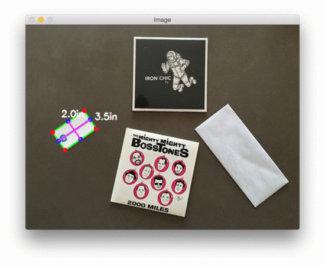

# Measuring Size of Objects with OpenCV
### Calculates the size of objects based on a given reference object

Cool object size estimator with just OpenCV and python

All thanks to Adrian Rosebrock (from [pyimagesearch](https://www.pyimagesearch.com/)) for making
great tutorials. This project is inspired from his blog: [Measuring size of objects in an image with OpenCV](https://www.pyimagesearch.com/2016/03/28/measuring-size-of-objects-in-an-image-with-opencv/). I have included the author's code and the one i wrote my self as well.

## **Key Points**
1. Steps involved:
    1. Find contours in the image.
    2. Get the minimum area rectangle for the contours.
    3. Draw the mid points and the lines joining mid points of the bounding rectangle of the contours.
    4. Grab the reference object from the contours and calculate **Pixel Per Metric** ratio.
    5. Calculate and print the bounding rectangle's dimensions based on the reference object's dimensions.
2. Assumptions:
    1. There is a reference object in the image which is easy to find and it's width/height is know to us.
3. Uses "Pixel Per Metric" ratio to calculate the size based on the given reference object.
4. Reference object properties:
    1. We should know the dimensions of this object (in terms of width or height).
    2. We should be able to easily find this reference object in the image, either based on the placement of the object (like being placed in top-left corner, etc.) or via appearances (like distinctive color and/or shape).
5. Used the United States quarter as the reference object.
6. Used the OpenCV's find contours method to find the objects in the image and calculated their dimensions.

 ## **Requirements: (with versions i tested on)**
 1. python          (3.7.3)
 2. opencv          (4.1.0)
 3. numpy           (1.61.4)
 4. imutils         (0.5.2)

 ## **Commands to run the detection:**
 ```
python object_size.py --image images/example_01.png --width 0.955
```

## **Results:**
The results are pretty decent even though not perfect. This is due the limitations of the image itself as its not perfect top-down view of the objects and some calibrations could have also been done in the camera before clicking the picture.





## **The limitations**
1. This technique requires the image to be near perfect top-down view of the objects to calculate the accurate results. Otherwise the dimensions of the objects in the image may be distorted.
2. The photos are prone to radial and tangential lens distortion which would lead to uneven object dimensions.
